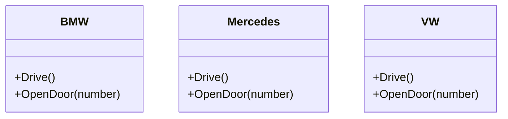
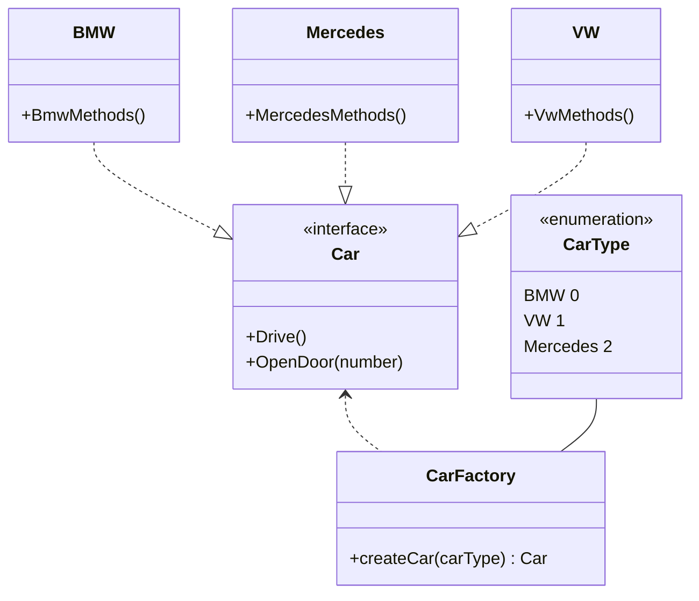
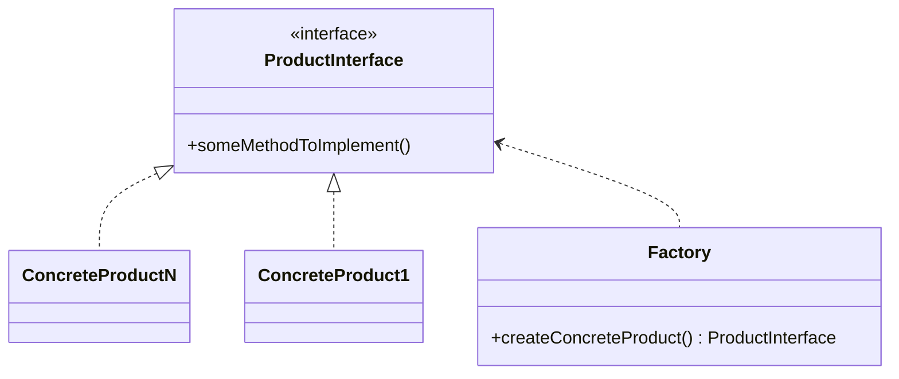

# Factory

## Problem

- many structs share methods and maybe some attributes that are similar
- those structs have a similar purpose

- explicit instantiation is only with the direct struct possible

## Solution -> Factory Pattern

### Simple Example

- make all structs implementing an interface
- create a factory function which "produces" an object
	- sometimes this function needs an argument
	- sometimes the implementation itself is solving the differentiation

- the created `Car` in `createCar(carType)` can than be casted dependend on the `CarType` if needed

## Explanation

- `BMW`, `Mercedes`, `VW` are called *concrete products*
- **clear code** want abstract dependencies
- therefore they implement from `Car` which is called *product interface*
- factory pattern would be nothing without a *factory*: `CarFactory`

## Implementation

Checkout the repository.

- modify in the `main.go` the different `CarType`s (0-2) to play with the functionality
	- 0 -> BMW
	- 1 -> Mercedes
	- 2 -> VW

